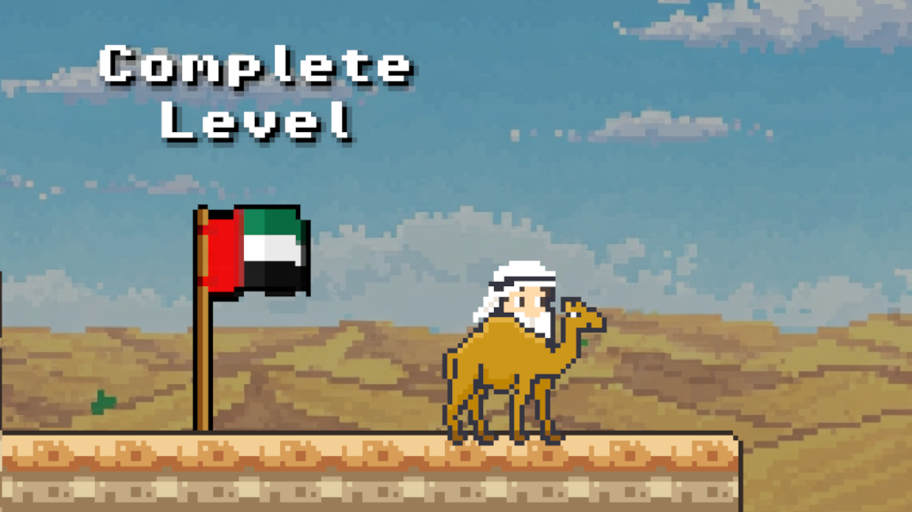

# Rimal

A short narrative-driven 2D platformer where players explore themes of tolerance, coexistence, and cultural heritage in a setting inspired by the United Arab Emirates.

## About the Game

Rimal was developed by Arthur Diniz and Erica de Castro for the 2025 Madar Tolerance Game Jam, organized under the Tolerance Clubs Initiative in the UAE. As you travel through golden dunes and vibrant cities, you’ll collect glowing pearls that reveal messages rooted in the values of unity, respect, and hospitality.

Symbolic obstacles like Scorpions of Misunderstanding stand in your way, but with courage — and a helpful camel or falcon — you’ll overcome them.

## Features

- Environments inspired by Emirati culture and landscape  
- Unlockable upgrades like a camel and a falcon  
- Collectible "Notes of Tolerance" that highlight peaceful coexistence  
- Original soundtrack and handmade pixel art  
- Built in Godot Engine using GDScript

## Controls

Keyboard:
- Arrow keys — Move  
- Space bar — Jump / Fly  
- Enter — Interact / Continue

## Play the Game

Play it on Itch.io: [Coming Soon](https://your-game-link.itch.io/sands-of-harmony)

## Project Structure

/assets → Sprites, backgrounds, UI elements

/scripts → GDScript files

/scenes → Level and UI scenes

/music → Original soundtrack

## License

This project is open source under the MIT License. See the [LICENSE](LICENSE) file for details.

## Screenshots

  
  

## Contributions

Want to improve or expand the project? Open a pull request or issue — contributions are welcome.
